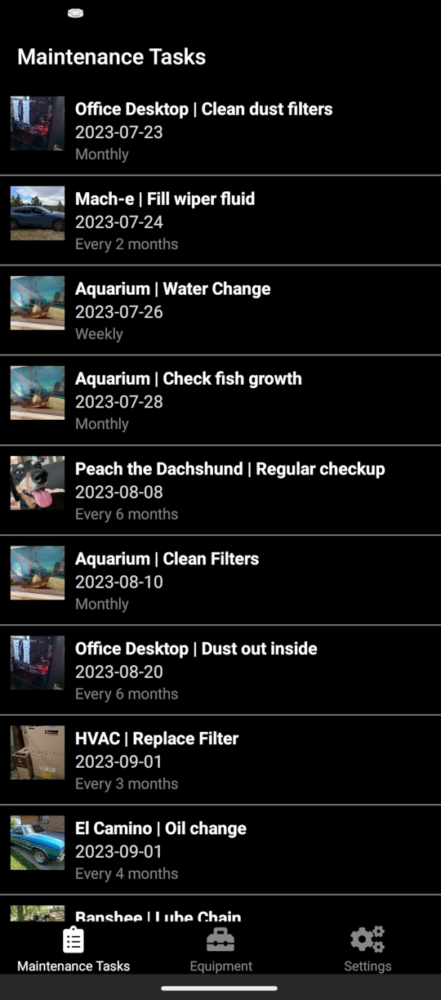
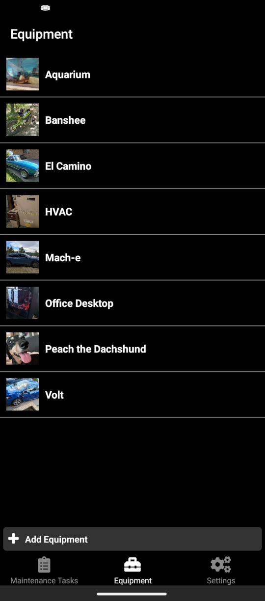
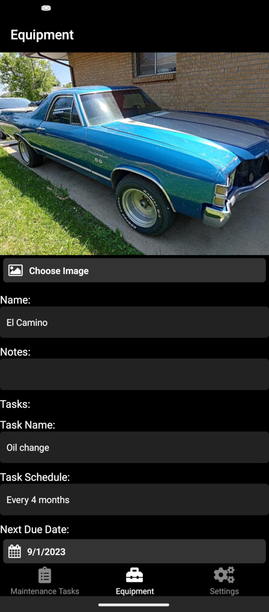
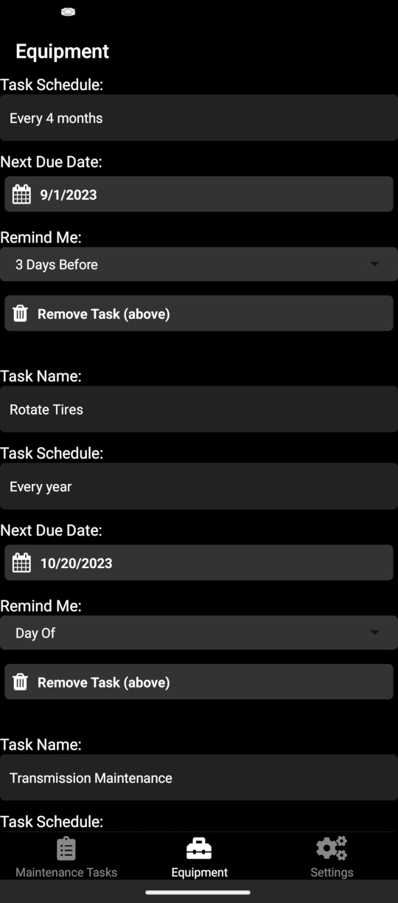
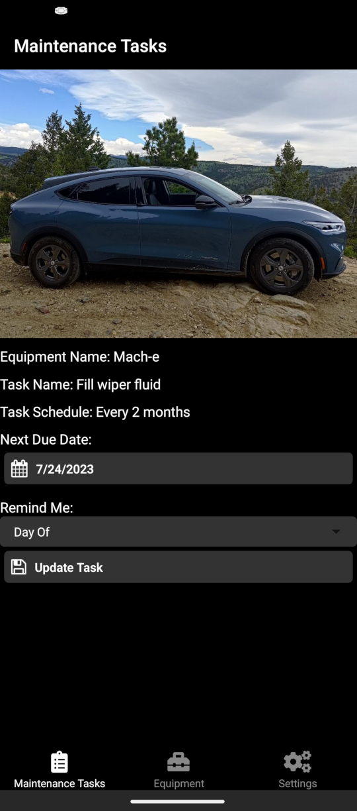
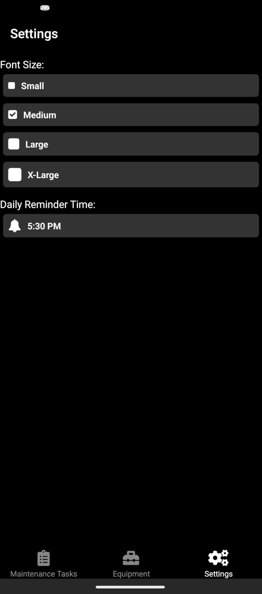

# Maintain

Maintain is a simple app to help remember the things around me that need maintenance. 

Let's be honest, I built this for myself to use on Android. But maybe it will be useful
to you too. Feel free to submit a PR if you want to expand functionality. If you run 
into a bug or think a feature would be nice, feel free to add an issue here. Although 
I'll probably only be developing features that I think are neat when I have the time.

Maintain has zero association 
with any current or former employer of mine.

## debugging the app

    npm install
    npx expo install @expo/vector-icons@14.0.3 \
        @react-native-community/datetimepicker@8.0.1 \
        @react-native-picker/picker@2.7.5 \
        expo-background-fetch@12.0.1 \
        expo-image-manipulator@12.0.5 \
        expo-image-picker@15.0.7 \
        expo-sqlite@14.0.6 \
        expo-status-bar@1.12.1 \
        expo-task-manager@11.8.2 \
        react-native@0.74.5 \
        react-native-safe-area-context@4.10.5 \
        @babel/core@7.24.0
    npm run start

Then use the expo app to scan the QR code

## screenshots

## license

`maintain-app` is offered under the Apache License 2.0.
